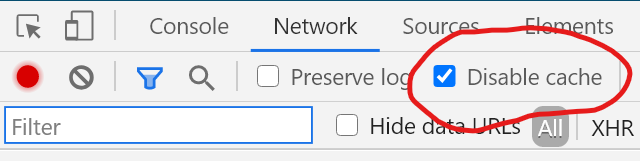

name: title
class: middle

# Django y React:<br> ¿ateje, teipe o cola-loca?

<hr/>

<div style="display: flex;grid-auto-flow: column;align-items: center;">
    
    <h2 style="margin:0px;">Python Pizza Holguín</h2>
<div>

---

## Quién soy?

<div style="display:flex">
    <div>
        
        <h5 style="text-align:center">Antonio Peña Batista</h5> 
    </div>
    <ul style="margin:0px 0px 0px 40px">
        <li>
            Profesor de programación en la Universidad de Holguín.
        </li>
        <li>
            Amante de JavaScript y Python.
        </li>
    </ul>
<div>

---

class: middle

<div style="display:grid;grid-template-columns:2fr 1fr 2fr;justify-items:center; align-items:center">
    
    <p style="font-size:5rem;margin:0px;position:relative;top:-20px">
        +
    </p>
    <div style="display:flex; flex-direction:column; align-items:center">
    
    <span style="font-size:3rem">React</span> 
    </div>
</div>

---

class: middle

<div style="display:grid;grid-template-columns:2fr 1fr 2fr;justify-items:center; align-items:center">
    
    <p style="font-size:5rem;margin:0px;position:relative;top:-20px">
        +
    </p>
    <div style="display:flex; flex-direction:column; align-items:center; position: relative; top:30px">
    
    <span style="font-size:2rem">React</span> 
    <div style="margin:50px;display:flex;flex-direction:column;align-items:center"> 
        
        <span style="font-size:2rem">Webpack</span> 
    <div>
    </div>
</div>
---

class: middle

<div style="display:grid;grid-template-columns:2fr 1fr 2fr;justify-items:center; align-items:center">
    
    <p style="font-size:5rem;margin:0px;position:relative;top:-20px">
        +
    </p>
    <div style="display:flex; flex-direction:column; align-items:center; position: relative; top:30px">
    
    <span style="font-size:2rem">React</span> 
    <div style="margin-top:20px;display:flex;flex-direction:column;align-items:center"> 
        
        <span style="font-size:2rem">Webpack</span> 
    <div>
    
    </div>
</div>

---

class: middle

<h1>
    ¿Qué opciones tengo para <b style="color:var(--primary-color)">pegar</b> estas dos herramientas?
</h1>

---

## Opción #1

.center[]
.center[El .red[ateje!]]

---

## API REST

<div style="display:grid;grid-auto-flow:column;justify-items:center; align-items:center">
    
    <p style="font-size:5rem; opacity: 0">
        +
    </p>
    <div style="display:flex; flex-direction:column; align-items:center; opacity: 0">
        
        Create React App
    </div>
</div>

---

## API REST + SPA

<div style="display:grid;grid-auto-flow:column;justify-items:center; align-items:center">
    
    <p style="font-size:5rem">
        +
    </p>
    <div style="display:flex; flex-direction:column; align-items:center">
        
        Create React App
    </div>
</div>

---

class: middle center

## 📣 Atención!!!

### ¡No olvides configurar el Intercambio de Recursos de Origen Cruzado([CORS](https://developer.mozilla.org/es/docs/Web/HTTP/Access_control_CORS)) en tú servidor!

---

[django-cors-headers](https://github.com/adamchainz/django-cors-headers)

```python
    # settings.py
    
    INSTALLED_APP = [
        ...
        'corsheaders',
    ]

    MIDDLEWARE = [
        ...
        'corsheaders.middleware.CorsMiddleware',
    ]

    # 📢 Solo en modo DEV
    CORS_ORIGIN_ALLOW_ALL = True

```

---

## Problemas con el "Ateje"

---

## Problemas con el "Ateje"

.box[😥 El modelo de negocio puede no admitir una SPA ]

---

## Opción #2

.center[]
.center[El .red[teipe!]]

---

class: middle center


---

class: middle center


<h2 style="margin:0px"> Pero configurandolo desde 0 😎</h2>

---

```javascript
    // webpack.config.js

    const webpack = require("webpack");
    const path = require("path");

    module.exports = (env) => {
        return {
            entry: {
                index: "./src/index.js",
            },
            output: {
                path: path.resolve("./dist"),
                filename: "bundle.js",
            },
        };
    };
```

---

```HTML+Django
    
    <!-- template.html -->

    <!--  -->
    <!DOCTYPE html>
    <html lang="en">
        <head>
            <meta charset="UTF-8" />
            <title>Hola mundo</title>
        </head>
        <body>
            ....
            <script src=""></script>
        </body>
    </html>
    >
```

---

## Problemas con el "Teipe"

---

## Problemas con el "Teipe"

### En modo desarrollo

---

## Problemas con el "Teipe"

### En modo desarrollo



---

## Problemas con el "Teipe"

### En modo desarrollo


### En modo producción

---

## Problemas con el "Teipe"

### En modo desarrollo


### En modo producción

### 💥💥💥

---

## Opción #3


---

class: middle center

<a style="font-size:2.5rem" href="https://github.com/jazzband/django-webpack-loader">django-webpack-loader</a>

---

```javascript
    // webpack.config.js

    var path = require("path");
    var webpack = require("webpack");
    var BundleTracker = require("webpack-bundle-tracker");

    module.exports = {
        entry: "./index.js",
        output: {
            path: path.resolve("./bundles/"),
            filename: "[name]-[hash].js",
        },

        plugins: [new BundleTracker({ filename: "./webpack-stats.json" })],
    };
```

---

```python
    # settings.py

    INSTALLED_APP = [
        ...
        'webpack_loader',
    ]

```

---

```HTML+Django
    
    <!-- template.html -->
    
    <html>
        <head>
            
        </head>
        <body>
            ....
            
        </body>
    </head>
    
```

---
# Alternativas

- [Django Manifest Loader](https://github.com/shonin/django-manifest-loader)

---

layout: false

## ¿Dónde me puedes encontrar?

|         |                                                        |
| ------- | ------------------------------------------------------ |
| Twitter | [@apenab1995](https://twitter.com/apenab1995)          |
| GitHub  | [github.com/apenab1995](https://github.com/apenab1995) |
| Email   | [apenab1995@gmail.com](mailto:apenab1995@gmail.com)    |

---

template: title
